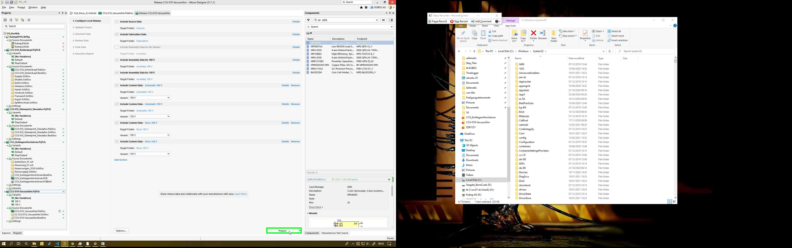

User right click in "CCU-010-VacuumSim.PrjPcb - Altium Designer (21.1.1)"

User left click on "CCU-010-VacuumSim.PrjPcb - Altium Designer (21.1.1) (window)"

User left click in "Release CCU-010-VacuumSim - Altium Designer (21.1.1)"

User left click on "Continue (pane)" in "External files"

